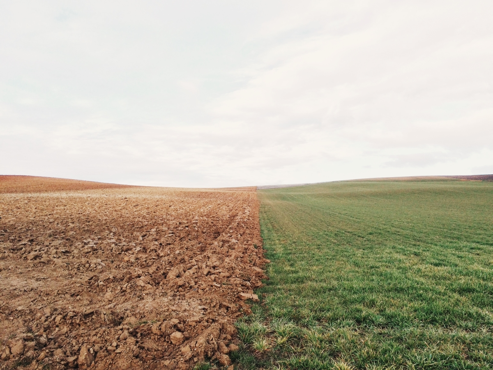

We tend to forget that our planet is alive.

### State of play

Currently, the world is only ruled by money and profit. Both of which are the direct result of the exploitation and transformation of raw materials.
But as these ressources are not infinite this model can't endure in time.

We should take into consideration what is available and work in harmony with it. This year, _2017_, the [Earth Overshoot Day](http://www.overshootday.org/) was the _2 of August_. It means, that past this date, we consumed more from nature than our planet can regenerate in a whole year.

As a result we're fully emerged into these faster and faster climate changes coming with their inducted consequences. Rising temperatures, more drought and heat waves, changes in precipitations patterns, stronger hurricanes, rising sea level and any more.

### What are the causes?

TODO

Animal agriculture (deforestation, methane emission, water)
Transport (pollution)

### Positive solutions and alternatives

TODO
- Changing the diet
- Invest & use renewable energy
- Waste-free (no plastic bag, bottles, packaging, ...)
- Organic & local (permaculture)
